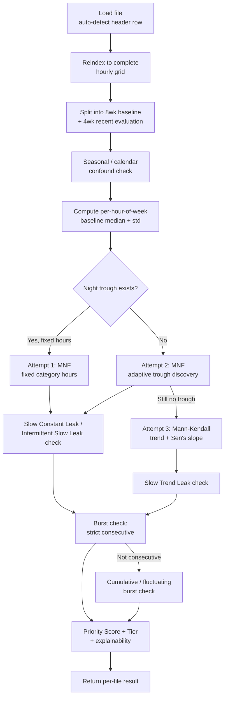
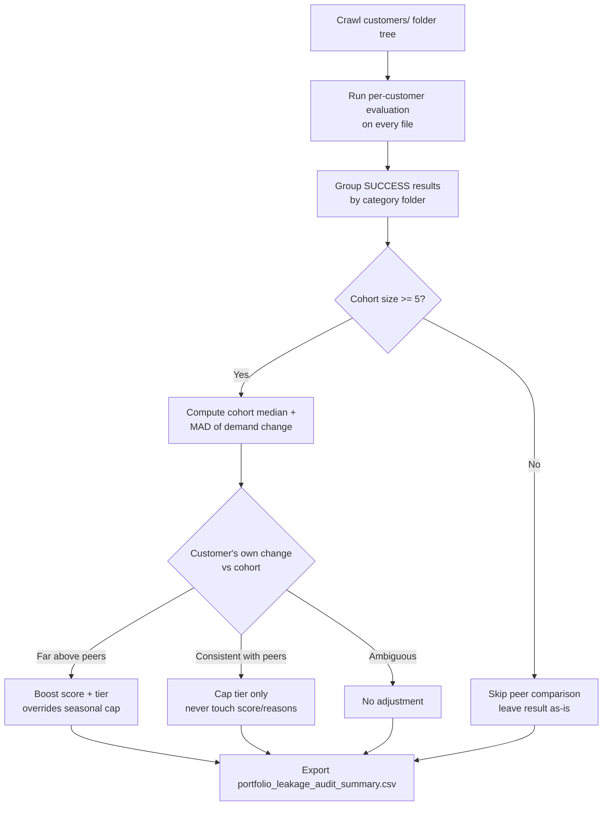

# System Architecture

## Overview

The system audits water customers for potential leaks using only hourly
consumption readings (`Hourly` timestamp, `Consumption m3` volume) — no
pressure sensors, no network topology, no labeled leak history. It runs in
two passes:

1. **Per-customer evaluation** (`analyze_leak_production_grade`) — every file
   is evaluated independently, using only that customer's own history as its
   baseline.
2. **Portfolio-level peer comparison** (`_apply_peer_comparison`) — a second
   pass, run once per category after every file in that category has been
   individually evaluated, that adjusts confidence based on how a flagged
   customer compares to their category peers *in the same run*.

This two-pass split is deliberate: a single-file function can never know
whether "everyone in Commercial spiked at once" — that requires seeing the
whole cohort, which only exists once every file has already been scored.

## Pipeline flow (per customer)

## Pipeline flow (portfolio level)

## Module map

| File / function | Responsibility |
|---|---|
| `_detect_header_row` | Locates the real header row in files with extra title/metadata rows above the actual columns |
| `_get_confound_periods` / `_find_confound_overlaps` | Rule-based lookup of known regional high-variance calendar periods (Ramadan/Eid, National Day, summer holidays, New Year) |
| `_mann_kendall_trend` | Nonparametric trend test + Sen's slope estimator, used as the slow-leak fallback for accounts with no reliable night trough |
| `_compute_night_floor` | Shared Minimum Night Flow computation (historical floor, rolling recent floor, evaluation validity, daily-minimum series) — reused by both the fixed-hours and adaptive-hours attempts |
| `analyze_leak_production_grade` | The core per-customer engine — runs all detection paths and returns one result dict per file |
| `_apply_peer_comparison` | Second-pass, portfolio-level confidence adjustment based on category cohort comparison |
| `run_portfolio_leak_audit` | Crawls the customer folder tree, calls the per-file engine on every file, then applies peer comparison, then exports the CSV |

## Design principle: self-comparison is the only thing that can create a flag

Every layer above self-comparison (seasonal confound handling, peer
comparison) is a **confidence modifier**, never a detector in its own right.
Nothing outside the core per-file statistical tests (MNF, Mann-Kendall,
burst) can turn a `NO` into a `YES`. This is intentional: it keeps every
"why was this flagged" answer traceable to one of three well-defined,
independently-validated statistical mechanisms, rather than to an opaque
combination of adjustments.