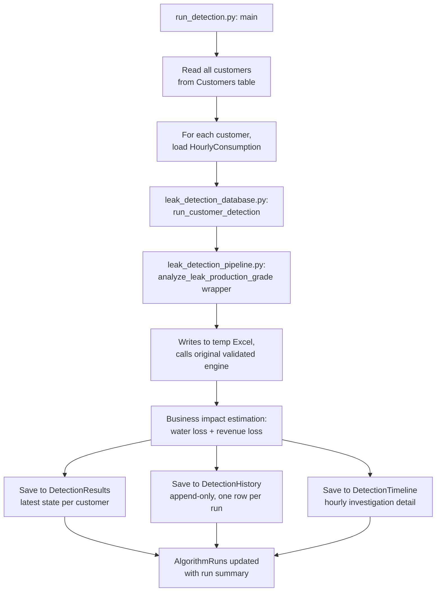

# Database and Dashboard

This document covers everything added after the core Python detection
logic: the SQLite backend that stores customer data and detection
results, the pipeline script that runs detection against it, and the
Power BI dashboard built on top. See `02_Algorithm_Design.md` for the
detection logic itself, which this layer calls without modifying.

> **Note:** this document was written from schema screenshots, two
> pipeline scripts (`leak_detection_database.py`, `run_detection.py`),
> and dashboard screenshots — not from direct access to the `.pbix` file
> or the live database. Some specifics (exact DAX formulas behind
> individual measures, the full list of dashboard interactions) are
> described at the level of what's visible in the screenshots, not
> verified line-by-line the way the Python logic was. Treat the DAX/measure
> descriptions here as a starting map, not a guaranteed-accurate spec —
> worth a pass to correct anything this got wrong.

## Why SQLite, and how it fits together

The original detection engine (`analyze_leak_production_grade` in
`leak_detection_pipeline.py`) still expects an Excel/CSV file per customer,
exactly as validated throughout `06_Validation.md`. Rather than rewrite
that validated logic, a thin wrapper (`analyze_leak_production_grade` in
`leak_detection_database.py` — note the name collision with the function
it calls, see the flag below) converts a customer's SQLite rows into a
temporary Excel file, calls the original file-based function
(`_analyze_leak_production_grade`) against it, and deletes the temp file
afterward. **The validated detection algorithm itself was not modified to
support the database** — only wrapped.

> **Naming flag worth fixing:** `leak_detection_database.py` defines its
> own `run_customer_detection`, which internally calls
> `analyze_leak_production_grade` — but `leak_detection_pipeline.py` *also*
> now has a function called `analyze_leak_production_grade` (the new
> DataFrame-based wrapper), which itself calls the real original logic,
> renamed internally to `_analyze_leak_production_grade`. Two different
> functions sharing the same name across two files, one of which wraps
> the other, is an easy source of future confusion — worth a rename pass
> (e.g. `analyze_leak_from_dataframe`) before this gets much bigger.

## Pipeline flow



Each run of `run_detection.py`:
1. Logs a new row in `AlgorithmRuns` with `Status = RUNNING`.
2. Loops through every customer in `Customers`, loads their hourly
   consumption, and runs detection.
3. Writes the latest result per customer to `DetectionResults` (this is
   what the Executive and Investigation dashboards read from directly).
4. Appends a row per customer to `DetectionHistory` (append-only — this is
   what makes the trend chart on the Executive dashboard possible, the
   exact data-history gap flagged as a prerequisite in
   `08_Future_Work.md` before this backend existed).
5. Replaces the hourly timeline for that customer in `DetectionTimeline`
   (delete-then-insert, so only the most recent run's timeline is kept
   per customer, not a full history of timelines).
6. Updates `AlgorithmRuns` with the final counts and `Status = SUCCESS` or
   `FAILED` (with `ErrorMessage`) once the whole run completes.

`FirstDetected` is deliberately preserved across runs (read from the
existing row before the `INSERT OR REPLACE`), so a customer flagged
repeatedly over several runs keeps their original detection date rather
than it resetting every time.

## New detection-layer addition: Residential Consumption Profile Check

This is genuinely new logic inside `leak_detection_pipeline.py`, not
present in the version documented in `02_Algorithm_Design.md` at the time
that document was written. It's a simple, independent screening check —
**it does not affect `Leak_Suspected`** — for Residential/Flat/Villa
customers only:

```
RESIDENTIAL_PROFILE_THRESHOLDS = {
    "Residential": 0.005 m3/hour (5 L/hour),
    "Flat":        0.005 m3/hour (5 L/hour),
    "Villa":       0.0075 m3/hour (7.5 L/hour),
}
PROFILE_CHECK_DAYS = 5
```

For each of the last 5 **complete** calendar days (24 full hourly
readings each — the most recent day is dropped if incomplete), it checks
whether that day's *minimum* hourly consumption stayed above the
category's threshold. If the minimum never dropped below threshold on
**all 5** days, the account is flagged `Abnormal Consumption`. If it's
below threshold on at least one of the 5 days, it's `Normal Consumption`.
If fewer than 5 complete days exist, it's `Insufficient Data`.

This is conceptually similar to Minimum Night Flow (a household that
never goes quiet), but simpler: a fixed absolute threshold rather than a
comparison against that customer's own historical baseline. Because it's
independent of `Leak_Suspected`, it's informational context shown on the
Investigation dashboard (see below), not a fourth detection path feeding
the priority score. Whether it *should* eventually feed into detection is
worth a deliberate decision, not an accidental one — right now it doesn't.

**See `02_Algorithm_Design.md`, which needs a matching update to document
this alongside MNF/Mann-Kendall/burst detection**, since it now lives in
the same file.

## New: business impact estimation (water loss and revenue)

This lives entirely in `leak_detection_database.py`, applied only to
customers where `Leak_Suspected == "YES"`. Three fallback methods, tried
in order, whichever the data supports first:

1. **Minimum Night Flow method** (preferred, used whenever both floors
   are available):
   ```
   Estimated Water Loss = max(0, Recent_Night_Floor − Historical_Night_Floor) × 24 hours
   ```
2. **Burst Excess Volume method** (used when MNF floors aren't available
   but a cumulative burst was detected): takes
   `Cumulative_Burst_Max_Excess_m3` directly from the detection result.
3. **Consumption Baseline Estimate** (last resort, used when neither of
   the above is available): compares the recent vs. historical daily
   median consumption directly, rather than the night floor specifically.

Revenue loss is then `Estimated Water Loss × tariff`, where tariff is
selected by category:

| Category | Tariff (QAR/m³) |
|---|---|
| Government | 7.0 |
| Commercial / Hotel / Farm | 5.2 |
| Residential / Villa / Flat / Industrial | 4.4 |

> **These are placeholder tariffs for the proof-of-concept**, explicitly
> flagged as such in the source (`WATER_TARIFFS` dict comment: *"Replace
> with the official Kahramaa tariff if available"*). Any revenue figures
> shown on the dashboard should be treated as illustrative until real
> tariff rates are confirmed and substituted in.

Which method was actually used for a given customer is stored in
`EstimationMethod`, visible on the Investigation dashboard, so it's never
ambiguous which of the three produced a given water-loss number.

## Connection helper: `database.py`

Small, single-purpose module providing `get_connection()`, used by
`run_detection.py`. Sets `row_factory = sqlite3.Row` so query results can
be accessed by column name (`row["KM_Number"]`) instead of by index,
which is what makes the `pd.read_sql_query` calls in `run_detection.py`
return properly-labeled DataFrames.

```python
from .config import DATABASE_PATH
```

> **Worth confirming this runs cleanly.** This is a *relative* import
> (the leading `.`), which only works if `database.py` is part of a
> proper Python package (an `__init__.py` present) and is imported as
> part of that package. But `run_detection.py` imports it as
> `from database import get_connection` — a plain, non-relative import,
> which suggests these files might be sitting as loose scripts rather
> than a package. If so, the moment `database.py` itself gets imported,
> the relative `.config` import would fail with *"attempted relative
> import with no known parent package."* If this already runs without
> error for you, the package structure is fine and this note doesn't
> apply — but if you've hit a confusing import error here before, this
> mismatch is almost certainly why.

`DATABASE_PATH` itself lives in a `config.py` module not yet reviewed —
worth sending over if there's anything else in it worth documenting here
(e.g. other configuration values the pipeline depends on).

## Database schema

Based on the schema browser screenshots. Column types and constraints as
shown; **not independently verified against the live database**.

### `Customers`
Static customer master data.

| Column | Type | Notes |
|---|---|---|
| `KM_Number` | TEXT | Primary key |
| `Name` | TEXT | Not null |
| `Zone` | TEXT | |
| `Category` | TEXT | Not null — drives detection thresholds, same category matching as the file-based pipeline |
| `EstimatedRevenueQAR` | REAL | |
| `PeakDemandM3` | REAL | |
| `TotalConsumptionM3` | REAL | |
| `CreatedAt` | DATETIME | Default current timestamp |

### `HourlyConsumption`
Raw hourly meter readings, the database equivalent of the `Hourly` /
`Consumption m3` columns the file-based pipeline expects.

| Column | Type | Notes |
|---|---|---|
| `ReadingID` | INTEGER | Primary key, autoincrement |
| `KM_Number` | TEXT | Not null |
| `Timestamp` | DATETIME | Not null |
| `ConsumptionM3` | REAL | Not null |

### `DetectionResults`
**Latest** detection result per customer — one row per `KM_Number`,
overwritten (`INSERT OR REPLACE`) on every run. This is what both
dashboard pages read for current state.

Key columns: `KM_Number` (PK), `DetectionStatus`, `LeakType`,
`PriorityScore`, `PriorityLevel`, `HistoricalNightFloor`,
`RecentNightFloor`, `RecentVsBaselinePctChange`, `NightTroughRatio`,
`MK_PValue`, `MK_SenSlope`, `PeakZScore` (reserved, not yet populated —
see below), `Evidence`, `DataCompleteness`, `EstimatedWaterLoss`,
`EstimatedRevenueLoss`, `EstimationMethod`, `AppliedTariff`,
`Recommendation`, `AISummary`, `ConsumptionProfileStatus`,
`ConsumptionProfileReason`, `ConsumptionProfileThresholdM3`,
`ConsumptionProfileDaysChecked`, `FirstDetected` (preserved across runs),
`LastDetected`, `LastUpdated`.

> `PeakZScore` is written as `None` in `leak_detection_database.py` with a
> `# Future enhancement` comment — it's in the schema and the dashboard
> data model, but not actually populated yet.

### `DetectionHistory`
**Append-only** — one row per customer per run, never overwritten. This
is the table that makes the Executive dashboard's trend chart possible.

Columns mirror `DetectionResults` (`DetectionID` PK autoincrement,
`RunID` FK to `AlgorithmRuns`, `KM_Number` FK to `Customers`,
`DetectionTime`, plus the same detection/estimation fields), without the
`FirstDetected`/`LastUpdated` bookkeeping fields since those only make
sense for a "latest state" table.

### `DetectionTimeline`
Hourly investigation detail, **replaced per customer on every run**
(old timeline deleted, new one inserted) — only the most recent run's
timeline is kept, not a history of timelines across runs.

| Column | Type | Notes |
|---|---|---|
| `TimelineID` | INTEGER | Primary key |
| `KM_Number` | TEXT | Not null |
| `Timestamp` | TEXT | Not null |
| `Period` | TEXT | `Historical_Baseline` or `Recent_Evaluation` |
| `ConsumptionM3` | REAL | Actual reading |
| `BaselineM3` | REAL | Expected value for that hour-of-week |
| `DeviationM3` | REAL | Actual minus baseline |
| `ZScore` | REAL | |
| `IsAnomaly` | INTEGER | 0/1 |
| `IsLeakSignal` | INTEGER | 0/1 — specifically the hours that contributed to the leak verdict, not just any statistical anomaly |

This is what powers the Investigation dashboard's "Leak Detection
Timeline" chart, including the First Detected / Last Detected / Leak
Detected markers.

### `TechnicianFeedback`
The feedback loop — this is the mechanism that closes the exact gap
flagged repeatedly in `08_Future_Work.md` and `06_Validation.md`:
*"no feedback loop exists yet connecting flagged customers to actual
investigation results."* Once technicians start using this, it becomes
possible to validate `Priority_Score` against real outcomes for the first
time.

| Column | Type | Notes |
|---|---|---|
| `FeedbackID` | INTEGER | Primary key, autoincrement |
| `DetectionID` | INTEGER | Not null — links to the specific `DetectionHistory` row being validated |
| `KM_Number` | TEXT | Not null |
| `Validation` | TEXT | Presumably confirmed-leak / false-positive / inconclusive — exact allowed values live in the `ValidationOptions` Power BI table, not confirmed from the schema alone |
| `RootCause` | TEXT | Exact allowed values live in the `RootCauseOptions` Power BI table |
| `Notes` | TEXT | |
| `TechnicianName` | TEXT | |
| `VisitDate` | DATETIME | |
| `ResolutionDate` | DATETIME | |

### `AlgorithmRuns`
One row per pipeline execution.

| Column | Type | Notes |
|---|---|---|
| `RunID` | INTEGER | Primary key, autoincrement |
| `RunTimestamp` | DATETIME | Default current timestamp |
| `CustomersProcessed` | INTEGER | |
| `LeaksDetected` | INTEGER | |
| `RuntimeSeconds` | REAL | |
| `Status` | TEXT | `RUNNING` / `SUCCESS` / `FAILED` |
| `ErrorMessage` | TEXT | Populated only on failure |

### Table count
Confirmed: 7 tables (`AlgorithmRuns`, `Customers`, `DetectionHistory`,
`DetectionResults`, `DetectionTimeline`, `HourlyConsumption`,
`TechnicianFeedback`). The schema browser's "Tables (8)" count was from an
extra table created by mistake and since removed — resolved, no longer a
gap.

## Power BI dashboard

### Pages
1. **Executive Dashboard** — portfolio-level view (see the design work in
   the earlier UI/UX conversation for the layout/branding details).
   Now includes, beyond what was documented earlier:
   - A **Network Leakage Trend** line chart, driven by a **field
     parameter** (`Leakage Trend Metric`) letting the viewer switch which
     metric is trended, reading from `DetectionHistory` — this is the
     trend chart discussed as a prerequisite in the earlier UI/UX pass,
     now actually built.
   - An embedded **AI Summary** panel with its own filters (Category,
     Priority Category, Detection Status Category, Zone).
   - The required refresh-time info icon (top right), matching the
     pattern from the brand design doc.
2. **Investigation Dashboard** — new, per-customer drill-down layer for
   technicians/operations, not present when the earlier documentation was
   written. Shows, per selected customer:
   - Customer profile (KM Number, Name, Category, Zone, Detection Status,
     Priority Score/Level)
   - Estimated Water Loss and Estimated Revenue at Risk cards
   - A **"Why was this customer flagged?"** explainability panel —
     Detection Pattern, What the system observed, Consumption Behavior,
     and a plain-language "Why?" explanation, sourced from
     `Priority_Reasons`/`Details`/`Evidence`
   - A **Supporting Evidence** panel (Night-time Flow status, Consumption
     Trend, % change vs. baseline, First/Last Detected dates, Data
     Quality/completeness)
   - The **Leak Detection Timeline** chart, built from `DetectionTimeline`
     — actual consumption vs. expected baseline, with markers for First
     Detected, Last Detected, and each Leak Detected hour, plus a
     date-range slider
   - A **Technician Feedback** button, presumably opening a form that
     writes into `TechnicianFeedback`
3. **Old - Executive Dashboard** — the prior version, kept as a tab for
   comparison/rollback rather than deleted. Worth deciding, once the new
   version is confirmed working, whether to remove this tab before wider
   distribution, or keep it intentionally as an internal reference.

### Key views
Three SQL views do most of the heavy lifting rather than the dashboard
querying base tables directly:
- **`vw_ExecutiveDashboard`** — aggregated, portfolio-level fields
  (Active Leaks, Active Suspected Leaks, Customers Monitored, Estimated
  Revenue at Risk, High/Medium Priority Alerts counts, Priority Category,
  Priority Sort, Zone, an "AI Executive Summary" measure, plus the trend
  fields).
- **`vw_InvestigationDashboard`** — per-customer detail fields matching
  what the Investigation page needs (Consumption Change, Consumption
  Trend Status, MK Trend Result, Night Flow Status, System Observation,
  Selected Detection Pattern, and the full set of detection/estimation
  fields).
- **`vw_DetectionHistory`** — the trend-chart-friendly shape of
  `DetectionHistory`, joined with category/zone context.

### Supporting tables/objects
- **`RefreshInfo`** — implements exactly the pattern from the Kahramaa
  design doc (`DateTimeRefreshed` + a `LastRefreshed` measure), now
  actually built rather than just specified.
- **`Leakage Trend Metric`** and **`Parameter`** — Power BI field
  parameters, letting a viewer switch which metric drives a visual via a
  dropdown rather than needing a separate chart per metric.
- **`RootCauseOptions`** / **`ValidationOptions`** — lookup tables
  presumably feeding dropdown choices in the Technician Feedback form.
